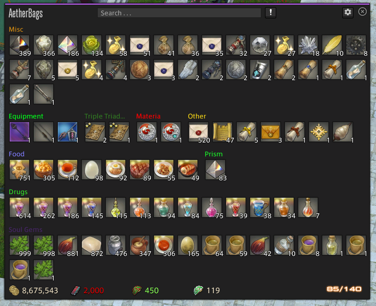

# AetherBags

A Final Fantasy XIV Dalamud Plugin that enhances your inventory by organizing and displaying bag contents using native UI elements (made possible by KTK, KamiToolKit). 

It supports user-defined categories with custom names, ordering/priority, colors, and rule-based item filtering (e.g., by item ID, name patterns, UI category, rarity, level/item level, vendor price, and various flags).

